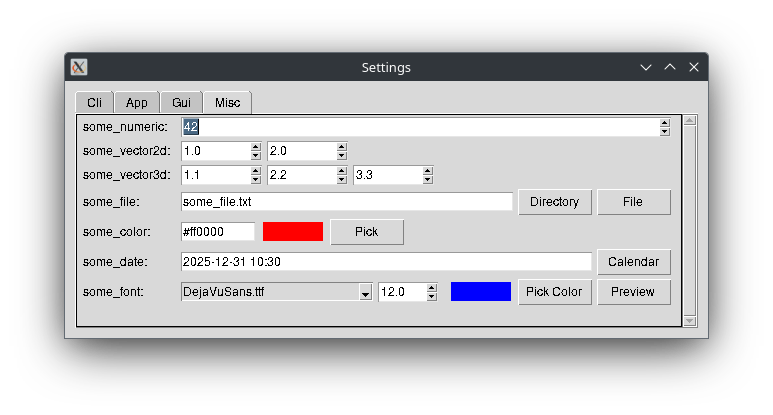
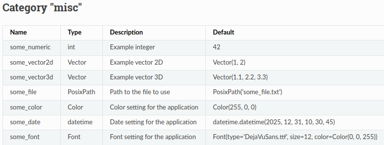

# Welcome to config-cli-gui

**Unified Configuration and Interface Management**

Provides a generic configuration framework that automatically generates both command-line interfaces and GUI settings dialogs from configuration parameters. 

[](https://github.com/pamagister/config-cli-gui/actions)
[](https://github.com/pamagister/config-cli-gui/releases)
[](https://config-cli-gui.readthedocs.io/en/stable/)
[](https://github.com/pamagister/config-cli-gui/blob/main/LICENSE)
[](https://github.com/pamagister/config-cli-gui/issues)
[](https://pypi.org/project/config-cli-gui/)
[](https://pepy.tech/project/config-cli-gui/)


`config-cli-gui` is a Python library designed to streamline the management of application configurations, 
generating command-line interfaces (CLIs), and dynamically creating graphical user interface (GUI) settings dialogs 
from a single source of truth. It leverages Pydantic for robust parameter definition and offers 
powerful features for consistent configuration across different application entry points.

---

## 🚀 Installation

You can install `config-cli-gui` using pip:

```bash
pip install config-cli-gui
```

---

## ✨ Features

  * **Single Source of Truth**: Define all your application parameters once, grouped in categories based on Pydantic's `BaseModel`. Config files, CLI, GUI and docs are all generated from these definitions.

    ```yaml
    misc:
      # Example integer | type=int
      some_numeric: 42
      # Path to the file to use | type=Path
      some_file: some_file.txt
      # Color setting for the application | type=Color
      some_color: '#ff0000'
      # Font setting for the application | type=Font
      some_font: 'DejaVuSans.ttf, 12, #0000ff'
    ```

  * **Categorized Configuration**: Organize your parameters into logical categories (e.g. `cli`, `gui`, `misc`). A built-in `app` category provides logging and theme settings for every project.
  * **Rich Types**: `bool`, `int`, `float`, `str`, `list`, `dict`, `Path`, `datetime` and the bundled `Color`, `Font` and `Vector` types are serialized, parsed from the command line and edited in the GUI.
  * **Dynamic CLI Generation**: `argparse` arguments (positional or flags) with help texts, types and choices are generated automatically.
  * **Config File Management**: Load and save YAML or JSON files. Saved YAML files contain a comment with description, type and choices for every parameter.
  * **GUI Settings Dialogs**: A Tkinter/ttkbootstrap settings dialog with one tab per category, type-specific editors (file browser, color picker, font preview, calendar), per-field validation and "Reset Tab".

    
 
  * **Documentation Generation**: Generate Markdown documentation for your CLI options and all configuration parameters, keeping your user guides always up-to-date with your codebase.

    

  * **Override System**: Clear precedence: declared defaults < `--config` file < command line arguments.

---

## 📚 Usage

### 1\. Define your configuration

Create categories by subclassing `ConfigCategory` and a manager by subclassing `ConfigManager`.
The parameter `name` is optional and defaults to the attribute name.

```python
# my_project/config.py
from datetime import datetime
from pathlib import Path

from config_cli_gui import Color, ConfigCategory, ConfigManager, ConfigParameter, Font, Vector


class CliConfig(ConfigCategory):
    def get_category_name(self) -> str:
        return "cli"

    input: ConfigParameter = ConfigParameter(
        value="", help="Path to input file", required=True, is_cli=True  # positional argument
    )
    min_dist: ConfigParameter = ConfigParameter(
        value=20, help="Minimum distance between two points", is_cli=True  # --min_dist
    )
    elevation: ConfigParameter = ConfigParameter(
        value=False, help="Include elevation data", is_cli=True  # --elevation [true|false]
    )


class MiscConfig(ConfigCategory):
    def get_category_name(self) -> str:
        return "misc"

    some_vector: ConfigParameter = ConfigParameter(value=Vector(1, 2, 3), help="Example vector")
    some_file: ConfigParameter = ConfigParameter(value=Path("some_file.txt"), help="File to use")
    some_color: ConfigParameter = ConfigParameter(value=Color(255, 0, 0), help="Color")
    some_date: ConfigParameter = ConfigParameter(value=datetime(2025, 12, 31, 10, 30), help="Date")
    some_font: ConfigParameter = ConfigParameter(
        value=Font("DejaVuSans.ttf", size=12, color=Color(0, 0, 255)), help="Font"
    )


class ProjectConfigManager(ConfigManager):
    """The built-in `app` category (logging, theme, ...) is added automatically."""

    cli: CliConfig
    misc: MiscConfig

    def __init__(self, config_file: str | None = None, **kwargs):
        super().__init__((CliConfig(), MiscConfig()), config_file, **kwargs)

    @staticmethod
    def get_app_name() -> str:
        return "my-app"  # used for the "last used config" store and the CLI docs
```

Access values via `config.<category>.<parameter>.value`:

```python
config = ProjectConfigManager(misc__some_color=Color(0, 255, 0))  # keyword overrides
print(config.cli.min_dist.value, config.app.log_level.value)

config.save_to_file("config.yaml")  # YAML or JSON, with descriptive comments in YAML
config = ProjectConfigManager("config.yaml")  # load it again
config.reset_to_defaults()  # restore the declared values
```

### 2\. Generate the CLI

`run_cli` parses the command line, loads `--config`, applies the CLI overrides and calls your
main function with a configured copy of your manager. `-v`/`--verbose` and `-q`/`--quiet` are
added automatically.

```python
# my_project/cli.py
import sys
from logging import Logger

from config_cli_gui import CliGenerator
from config_cli_gui.logging import initialize_logging

from my_project.config import ProjectConfigManager


def run(config: ProjectConfigManager, logger: Logger) -> int:
    logger.info(f"Processing {config.cli.input.value} (min_dist={config.cli.min_dist.value})")
    return 0  # exit code


def main() -> int:
    config = ProjectConfigManager()
    logger = initialize_logging(
        log_level=config.app.log_level.value,
        enable_file_logging=config.app.enable_file_logging.value,
    ).get_logger("cli")
    return CliGenerator(config, app_name="my-app").run_cli(run, logger=logger)


if __name__ == "__main__":
    sys.exit(main())
```

```bash
my-app --config config.yaml --min_dist 50 --elevation -v data.gpx
```

### 3\. Integrate the GUI settings dialog

```python
import ttkbootstrap

from config_cli_gui import SettingsDialogGenerator

from my_project.config import ProjectConfigManager

config = ProjectConfigManager()
root = ttkbootstrap.Window(themename=config.app.theme.value)

dialog = SettingsDialogGenerator(config).create_settings_dialog(root, config_file="config.yaml")
root.wait_window(dialog.dialog)
if dialog.result == "ok":  # values were applied to `config` and saved to config.yaml
    print(config.misc.some_color.value)
```

### 4\. Generate documentation and a default config file

```python
from config_cli_gui import DocumentationGenerator

from my_project.config import ProjectConfigManager

doc_gen = DocumentationGenerator(ProjectConfigManager())
doc_gen.generate_default_config_file("config.yaml")
doc_gen.generate_config_markdown_doc("docs/usage/config.md", config_file_path="../../config.yaml")
doc_gen.generate_cli_markdown_doc("docs/usage/cli.md")  # command name from get_app_name()
```

A complete example project (CLI, GUI with log window, docs generation) is located in
[`tests/example_project`](https://github.com/pamagister/config-cli-gui/tree/main/tests/example_project).
